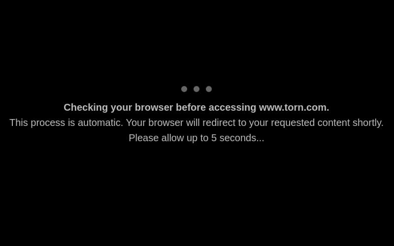

# TORN Dark Browser Checking Page

Userscript to make the browser checking page dark.

Installation:

1. Install [TamperMonkey extension](https://www.tampermonkey.net/) for Chrome, or [GreaseMonkey extension](https://addons.mozilla.org/en-US/firefox/addon/greasemonkey/) for Firefox.
2. Navigate to the [script file](https://github.com/juzraai/torn-dark-browser-check/raw/main/torn-dark-browser-check.user.js), then click *Install*.

Screenshot:

Enjoy!